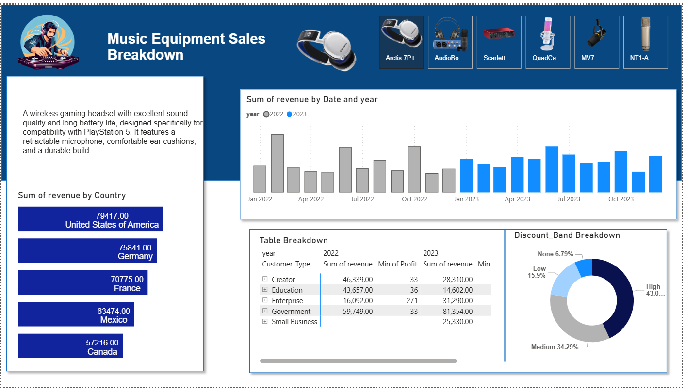

Music Equipment Sales Dashboard

Project Overview
This project is an end-to-end data analysis and visualization dashboard for music equipment sales. It tracks key metrics such as revenue, profit, and sales trends over time.

Features

Data processing and analysis using Excel and SQL Server

Interactive dashboard created with Power BI

Visualization of sales performance and product analytics

Easy-to-understand reports to assist business decision-making

Technologies Used

Microsoft Excel for data preparation

SQL Server for database management and querying

Power BI for building interactive dashboards

How to Use

Open the Power BI file located in the powerbi folder to explore the dashboard.

SQL scripts are available in the sql folder to set up and query the database.

Dashboard Preview
Below is a screenshot of the interactive dashboard built with Power BI:

